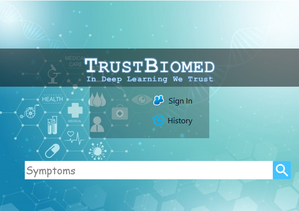

# TrustBIOMED
Système de recherche d’information biomédicale basé sur le Deep Learning.

Mots clés : Recherche d’information, Deep Learning, Word Embedding, LSTM.

# Page d'accueil

# Page de l'administrateur

